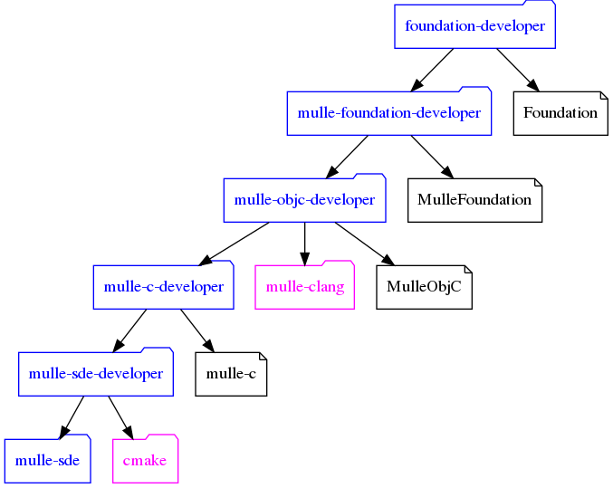

# foundation-developer

#### 👒 Objective C with mulle-sde and the MulleFoundation

**foundation-developer** is a collection of *mulle-sde extensions* to support development
with the [MulleFoundation](//github.com/MulleFoundation). You need to install the
compiler [mulle-clang](//github.com/Codeon-GmbH/mulle-clang-project) and the
debugger [mulle-gdb](//github.com/Codeon-GmbH/mulle-gdb) separately.

As a package for **homebrew** (OS X) and **apt** (Linux) it is also the most
convenient way to install [mulle-sde](//github.com/mulle-sde/mulle-sde).


Project      | Build Status
-------------|-----------------------------------
|  [](https://travis-ci.org/MulleFoundation/foundation-developer)


*foundation-developer* enables the use of `<Foundation/Foundation.h>` in your
projects. It is very thin package atop of
[mulle-foundation-developer](//github.com/MulleFoundation/mulle-foundation-developer).

See [De Re MulleObjc](//github.com/mulle-objc/De-Re-MulleObjC) for an introduction
to *mulle-objc*.

See [mulle-sde Wiki](//github.com/mulle-sde/mulle-sde/wiki) for an introduction
to *mulle-sde*.

For further information to get you up and running, see the [mulle-objc Community](//mulle-objc.github.io).


Extension                 | Type | Description
--------------------------|------|----------------------------
foundation/objc-developer | meta | Create Objective-C projects

### Table of Contents

- [Usage](#Usage)
- [Install](#Install)
- - [Packages](#Packages)
- - [Script](#Script)
- - [Docker](#Docker)
- [Relations](#Relations)


## Usage

The following examples show how to use the *MulleFoundation* with the
*mulle-sde* environment. You can also use the
[legacy workflow](https://mulle-objc.github.io/De-Re-mulle-objc/mydoc_legacy.html)
with `Makefiles` or some such.


### Check that the (meta) extensions are found:

```
mulle-sde extension show
```

### Create an Objective-C executable project

```
mkdir foo
cd foo
mulle-sde init -m foundation/objc-developer executable
```

Just follow the instructions *mulle-sde* prints.

> There will be an error because of a missing MulleObjCDecimalLibrary. This
> is normal.


### Create an Objective-C library project

```
mulle-sde init -d foolib -m foundation/objc-developer library
cd foolib
mulle-sde craft
```


# Install

The initial install will only add *mulle-sde* to your system. The Foundation
itself will be fetched by *mulle-sde*, when you create a new project
(see **Usage** above).

There is a variety of installation methods:

* **Packages**
* **Docker**
* **Script**


## Packages

OS      | Package manager | Command
--------|-----------------|-----------------------------------
macos   | homebrew        | `brew install mulle-kybernetik/software/foundation-developer`
debian  | apt             | `sudo apt-get -y install foundation-developer` (but see below)
ubuntu  | apt             | `sudo apt-get -y install foundation-developer` (but see below)


### apt

As prerequisites there are some very basic packages that need to be installed
first. They are usually present on anything but a barebones system.


#### Prerequisites

Package               | Comment
----------------------|--------------------------
`wget` or `curl`      | to fetch stuff
`gnupg`               | *apt-key* may require it
`lsb-release`         | For the repository source list
`apt-transport-https` | To let *apt-get* fetch via https
`sudo`                | Or run everything as root
`libncurses5`         | Debian only (?)

```
apt-get install apt-transport-https gnupg lsb-release sudo wget
```

You need to install the compiler [mulle-clang](//github.com/Codeon-GmbH/mulle-clang-project)
and the debugger [mulle-gdb](//github.com/Codeon-GmbH/mulle-gdb) separately.

From here on it's assumed, that sudo is installed. If you don't have *sudo*,
edit out the *sudo* from the command lines and run everything as `root`


#### One line install

You can use this one-liner to do all the following steps in one:

```
wget -qO - https://raw.githubusercontent.com/MulleFoundation/foundation-developer/release/bin/apt-installer \
| sudo sh
```


#### Install the GPG keys:

Otherwise first add the necessary key to *apt*:

```
wget -qO - "https://www.mulle-kybernetik.com/dists/debian-admin-pub.asc" \
| sudo apt-key add -
```

#### Add the *apt* repository source list:

```
echo "deb [arch=all] http://www.mulle-kybernetik.com `lsb_release -c -s` main" \
| sudo tee "/etc/apt/sources.list.d/mulle-kybernetik.com-main.list" > /dev/null
```

Now you are ready to install *foundation-developer*:

```
sudo apt-get update
sudo apt-get install foundation-developer
```

#### Download and install the mulle-clang compiler

Check the [compiler releases](https://github.com/Codeon-GmbH/mulle-clang-project/releases)
for the proper version to download:

```
curl -L -O "https://github.com/Codeon-GmbH/mulle-clang-project/releases/download/11.0.0.0/mulle-clang-11.0.0.0-bullseye-amd64.deb"
sudo dpkg --install "mulle-clang-11.0.0.0-bullseye-amd64.deb"
```


### Docker

There is a [Dockerfile](https://raw.githubusercontent.com/MulleFoundation/foundation-developer/release/Dockerfile) in the project. To build and run an ephemeral development container named `foundation` based on ubuntu, do:

```
sudo docker build -t foundation 'https://raw.githubusercontent.com/MulleFoundation/foundation-developer/release/Dockerfile'
sudo docker run --cap-add=SYS_PTRACE --security-opt seccomp=unconfined -i -t --rm foundation
```


### Script

*mulle-sde* provides an
[installer-all](https://raw.githubusercontent.com/mulle-sde/mulle-sde/release/bin/installer-all)
script to install *foundation-developer* into `/usr` (or some other place).
This is suitable for environments without supported package managers like for
instance *Fedora* or *FreeBSD*.

Prerequisites         | Comment
----------------------|--------------------------
`build-essential`     | The usual compiler tools like cc, ar, nm
`curl`                | To fetch stuff, or substitute with wget
`cmake`               | Shoot for cmake 3.1 or higher
`sudo`                | Or run everything as root
`uuid-runtime`        | `uuidgen` is needed by mulle-sde
`bsdmainutils`        | Needed for `column`. A dependency that should go away...
`less`                | Should be optional, but isn't right now

You need to install the compiler [mulle-clang](//github.com/Codeon-GmbH/mulle-clang-project)
and the debugger [mulle-gdb](//github.com/Codeon-GmbH/mulle-gdb) separately.


#### Install into /usr/local with sudo

``` sh
curl -L -O 'https://raw.githubusercontent.com/mulle-sde/mulle-sde/release/bin/installer-all' && \
chmod 755 installer-all && \
sudo OTHER_PROJECTS="MulleFoundation/foundation-developer;latest \
MulleFoundation/mulle-foundation-developer;latest \
mulle-objc/mulle-objc-developer;latest \
mulle-c/mulle-c-developer;latest" \
SDE_PROJECTS="mulle-sde-developer;latest \
mulle-test;latest" \
./installer-all /usr/local
```

#### Install into ${HOME} (without sudo)

``` sh
curl -L -O 'https://raw.githubusercontent.com/mulle-sde/mulle-sde/release/bin/installer-all' && \
chmod 755 installer-all && \
OTHER_PROJECTS="MulleFoundation/foundation-developer;latest \
MulleFoundation/mulle-foundation-developer;latest \
mulle-objc/mulle-objc-developer;latest \
mulle-c/mulle-c-developer;latest" \
SDE_PROJECTS="mulle-sde-developer;latest \
mulle-test;latest" \
./installer-all ~ no
```

You will need to install [mulle-clang](//github.com/Codeon-GmbH/mulle-clang)
yourself though.


## Relations


